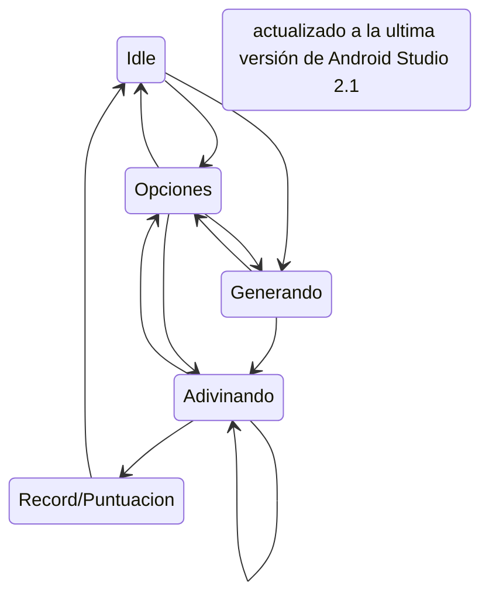

# Damian Dice

Nos han solicitado a Diego Gil Lis y a Gregorio Camara Depablos el desarrollo de un proyecto: la creación de un juego idéntico a "Simón Dice", el cual estará personalizado para nuestro cliente, Damián.

Este proyecto se concibe como una aplicación interactiva que pondrá a prueba la memoria y la concentración del usuario, siguiendo la mecánica clásica del juego: replicar una secuencia de colores que se vuelve progresivamente más larga.

---
Preparación 
---

Para dar inicio al desarrollo de esta aplicación, la primera etapa crucial fue la conceptualización de su flujo interno. Como es tradición en desarrollo de software, lo primero que hicimos fue coger papel y lápiz. Este enfoque tradicional nos permitió esquematizar rápidamente las transiciones y estados del sistema en el siguiente desplegable.

<h3>Diagrama de estados</h3>

    

---
Desarrollo del proyecto
---

Una vez definido el esqueleto lógico mediante el Diagrama de Estados, la siguiente prioridad fue la organización de las tareas y la implementación del entorno de trabajo.

Procedimos a dividirnos las responsabilidades mediante la creación de issues específicos en nuestro repositorio de GitHub. Esta metodología de trabajo no solo nos permite un seguimiento eficiente del progreso, sino que también evita conflictos de código. Después de haber comprendido y asignado claramente las funciones que debía cumplir cada miembro del equipo, comenzamos el desarrollo.

Utilizando las buenas prácticas y los patrones de diseño aprendidos en clase, dimos inicio a la codificación mediante la creación de las siguientes clases principales que modelarán la arquitectura de nuestro juego "Simón Dice":

<h3>Datos.kt</h3>

Actúa como un contenedor estático (object) para el estado global y las constantes del juego. Centraliza todas las variables de persistencia y control que deben ser accesibles y observables por el resto de la aplicación.

Elementos Clave:

**secuenciaMaquina:** Lista mutable que almacena los números de los colores generados por la máquina en la secuencia actual. (Crucial para el juego de secuencia creciente)

**secuenciaJugador:** Lista mutable que almacena los números de los botones pulsados por el usuario.

**victorias y rondasSuperadas:** Utilizan MutableStateFlow para permitir la observación reactiva y almacenar la puntuación actual y el récord.

**isPrinted:** Flag (MutableStateFlow<Boolean>) utilizado por la UI para evitar que la secuencia se repita si el estado cambia sin una nueva generación.

**Colores (enum class):** Define los cuatro colores principales y el botón 'Start'. Asocia un id (0-4), el color principal, un color_suave (para el parpadeo de la secuencia) y el txt de la etiqueta.

**Estados (enum class):** Define los estados del juego (INICIO, GENERANDO, ADIVINANDO, ERROR, etc.). Cada estado lleva consigo las banderas booleanas:

**start_activo:** Controla si el botón "Start" está habilitado.

**boton_activo:** Controla si los botones de colores están habilitados para la entrada del jugador.

**colorearSecuencia:** Flag que dispara la animación de la secuencia en la JuegoScreen.

<h3>MyViewModel.kt</h3>

Es el cerebro del juego. Contiene la lógica principal, gestiona las transiciones de estados y coordina la actualización de los datos en Datos.kt.

Funciones Clave:

**crearRandom():** Limpia la secuencia del jugador, establece el estado a ESPERANDO. Genera un número aleatorio (0 a 3) y lo añade al final de Datos.secuenciaMaquina (haciendo crecer la secuencia) y finaliza cambiando el estado a GENERANDO para que la UI inicie la animación de la secuencia.

**comprobar():** Lógica de validación central.

**Comprobación:** Valida si el último pulso del jugador coincide con el pulso correspondiente de la máquina (secuenciaJugador[index] != secuenciaMaquina[index]).

**Fallo:** Si hay un error, actualiza el récord (rondasSuperadas), resetea las victorias a 0 y cambia el estado a Estados.ERROR.

**Acierto Parcial:** Si la secuencia coincide, pero el jugador aún no ha completado todos los pasos de la secuencia actual, la función retorna, esperando más pulsos.

**Acierto Total:** Si la secuencia del jugador es igual a la de la máquina, incrementa victorias y llama a crearRandom() para empezar la siguiente ronda.

**reiniciarJuego():** Función para el Game Over. Limpia ambas secuencias y vuelve al estado Estados.INICIO.

<h3>UI.kt</h3>

Define los componentes de Jetpack Compose (la Vista) que dibujan la interfaz y reaccionan a los cambios de estado notificados por el MyViewModel.

Elementos Clave:

**IU(miViewModel):** Función Composable principal que utiliza un Observer de estadoLiveData para decidir qué pantalla renderizar (JuegoScreen o GameOverScreen).

**JuegoScreen:** Contenedor de la vista principal del juego (marcadores, botones de colores y botón "Start").

**Animación de Secuencia:** Contiene la función colorearSecuencia() dentro de un LaunchedEffect. Esta corrutina se dispara cuando el estado es GENERANDO, itera sobre secuenciaMaquina, y usa delay(1000) para colorear y descolorear los botones con el color_suave, mostrando la secuencia a memorizar.

**Boton:** Componente reutilizable para los cuatro botones de colores. Observa el estado del ViewModel para gestionar su propiedad enabled. Al hacer clic, llama a miViewModel.comprobar().

**Boton_Start:** Botón de inicio. Utiliza un LaunchedEffect(_activo) con un bucle while y delay() para crear el efecto de parpadeo (púlsar entre color y color_suave) solo cuando el estado es INICIO.

**GameOverScreen:** Muestra el mensaje de fallo y el récord (rondasSuperadas). El botón "Volver a Empezar" llama a miViewModel.reiniciarJuego().

<h3>MainActivity.kt</h3>

Es la actividad principal de Android y el punto de entrada de la aplicación.

Función Clave:

**onCreate():** Inicializa la instancia del MyViewModel y utiliza setContent para renderizar la interfaz principal (IU(miViewModel)), inyectando el ViewModel en la jerarquía de Compose.

---
Decisiones clave de diseño
---

A continuación, se justifican las principales decisiones arquitectónicas y tecnológicas adoptadas:

<h3>Gestión del Estado del Juego</h3>

**Decisión:** Uso del enum class Estados en conjunto con LiveData en el MyViewModel para representar una Máquina de Estados Finitos (FSM).

**Justificación:** Garantiza que el juego se encuentre siempre en un estado válido y predecible (INICIO, GENERANDO, ADIVINANDO, ERROR). Esto controla cuándo se activan los botones (boton_activo) y la animación de la secuencia (colorearSecuencia).

<h3>Uso de Jetpack Compose</h3>

    
**Decisión:** Interfaz de usuario declarativa implementada completamente con Jetpack Compose.

**Justificación:** Permite un desarrollo de UI más rápido y reactivo. La interfaz se actualiza automáticamente solo en los componentes afectados cuando el estado cambia, optimizando el rendimiento.

<h3>Persistencia de Datos Reactiva</h3>

    
**Decisión:** Utilización de MutableStateFlow (en Datos.kt) para variables críticas como victorias y rondasSuperadas.

**Justificación:** StateFlow ofrece una manera eficiente y asíncrona de exponer flujos de datos a la UI. Esto permite que los composables (como el texto de la puntuación en JuegoScreen) se actualicen de forma reactiva y con mayor rendimiento.

<h3>Componentes Reutilizables y Animación Asíncrona</h3>
 
    
**Decisión:** Creación de funciones @Composable específicas como Boton y Boton_Start. Además, se usa LaunchedEffect para animaciones.

**Justificación:**

Mejora la modularidad y reduce la duplicación de código.

El Boton_Start utiliza LaunchedEffect para gestionar la animación de parpadeo de forma controlada y eficiente (solo se activa en el estado INICIO).

La secuencia de colores en JuegoScreen también usa una corrutina con delay() dentro de un observer para sincronizar la animación.

---
Fuincionamiento del programa 
---

Esta sección presenta las pruebas de la aplicación "Damian Dice" que demuestran la correcta implementación de la lógica del juego y la gestión de los estados, confirmando el patrón MVVM

  

  
