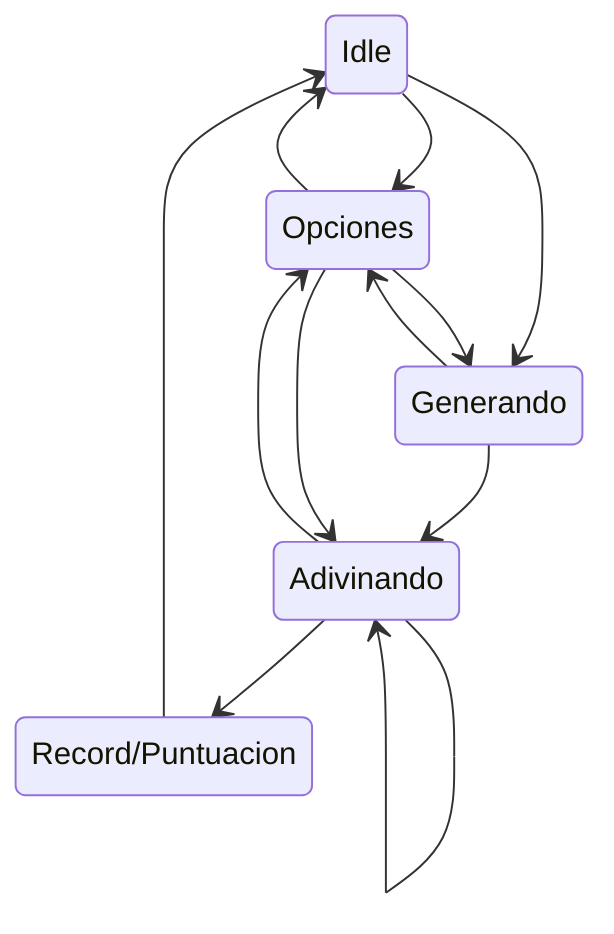

# Damian Dice

Nos han solicitado a Diego Gil Lis y a Gregorio Camara Depablos el desarrollo de un proyecto: la creación de un juego idéntico a "Simón Dice", el cual estará personalizado para nuestro cliente, Damián.

Este proyecto se concibe como una aplicación interactiva que pondrá a prueba la memoria y la concentración del usuario, siguiendo la mecánica clásica del juego: replicar una secuencia de colores que se vuelve progresivamente más larga.

---
Preparación 
---

Para dar inicio al desarrollo de esta aplicación, la primera etapa crucial fue la conceptualización de su flujo interno. Como es tradición en desarrollo de software, lo primero que hicimos fue coger papel y lápiz. Este enfoque tradicional nos permitió esquematizar rápidamente las transiciones y estados del sistema en el siguiente desplegable.

<h3>Diagrama de estados</h3>

    

---
Desarrollo del proyecto
---

Una vez definido el esqueleto lógico mediante el Diagrama de Estados, la siguiente prioridad fue la organización de las tareas y la implementación del entorno de trabajo.

Procedimos a dividirnos las responsabilidades mediante la creación de issues específicos en nuestro repositorio de GitHub. Esta metodología de trabajo no solo nos permite un seguimiento eficiente del progreso, sino que también evita conflictos de código. Después de haber comprendido y asignado claramente las funciones que debía cumplir cada miembro del equipo, comenzamos el desarrollo.

Utilizando las buenas prácticas y los patrones de diseño aprendidos en clase, dimos inicio a la codificación mediante la creación de las siguientes clases principales que modelarán la arquitectura de nuestro juego "Simón Dice":

<h3>Datos</h3>

Actúa como un contenedor de estado global y constantes para el juego. Almacena las variables clave que persisten a lo largo de la ejecución.

Elementos Clave:

**Datos (object):** Almacena el puntaje actual (victorias), el récord (rondasSuperadas) y la última secuencia generada (numero). Utiliza MutableStateFlow para permitir la observación reactiva del score por parte de la interfaz.

**Colores (enum):** Define los cuatro colores principales del juego (Rojo, Verde, Azul, Amarillo) y el color del botón Start, asociando a cada uno su respectivo objeto Color de Compose.

**Estados (enum):** Define los cinco estados posibles del juego (INICIO, GENERANDO, ADIVINANDO, RECORD, ERROR), controlando qué elementos de la interfaz deben estar activos (botones, Start) en cada momento.

<h3>MyViewModel</h3>

Es el cerebro de la aplicación. Contiene toda la lógica del juego, maneja los estados y coordina la actualización de los datos.

Elementos Clave:

**estadoLiveData:** Variable clave que notifica a la interfaz (UI) sobre el estado actual del juego, siguiendo el patrón Observer.

**crearRandom():** Cambia el estado a GENERANDO, genera un número aleatorio (0 a 3) que representa la nueva secuencia y lo almacena.

**comprobar(ordinal:** Ejecuta la lógica central de validación. Compara el botón pulsado por el usuario con el número guardado. Si acierta, incrementa victorias; si falla, guarda el récord en rondasSuperadas, resetea victorias y cambia el estado a ERROR (Game Over).

<h3>IU</h3>

Se encarga de la presentación visual y reacciona a los cambios de estado del ViewModel. Es la "Vista" dentro del patrón MVVM.

Elementos Clave:

**IU(miViewModel):** Función principal que utiliza un observer para cambiar dinácticamente la pantalla (JuegoScreen o GameOverScreen) según el valor de estadoLiveData.

**JuegoScreen / GameOverScreen:** Componentes que dibujan la interfaz principal del juego y la pantalla de fin de partida, mostrando la puntuación y el récord.

**Boton / Boton_Start:** Componentes reutilizables que controlan su propia activación consultando el estado del juego (boton_activo / start_activo) y comunican las acciones de pulsación al MyViewModel.

<h3>MainActivity</h3>

Es el punto de entrada de la aplicación Android. Se encarga de inicializar el entorno y crear la instancia del MyViewModel para pasárselo a la interfaz.

  
